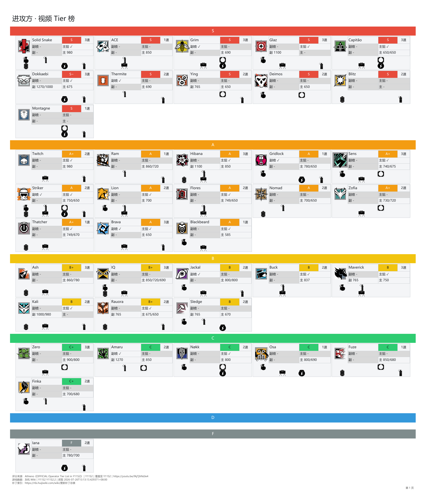
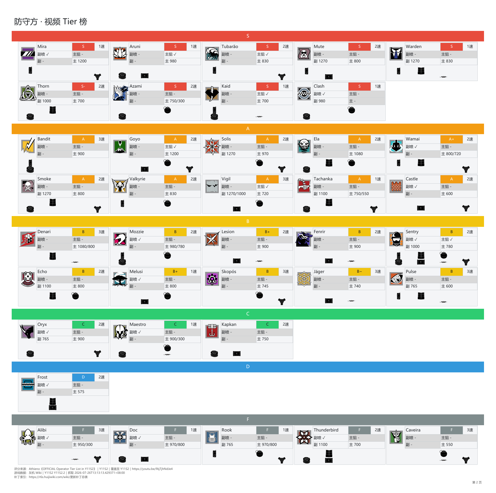
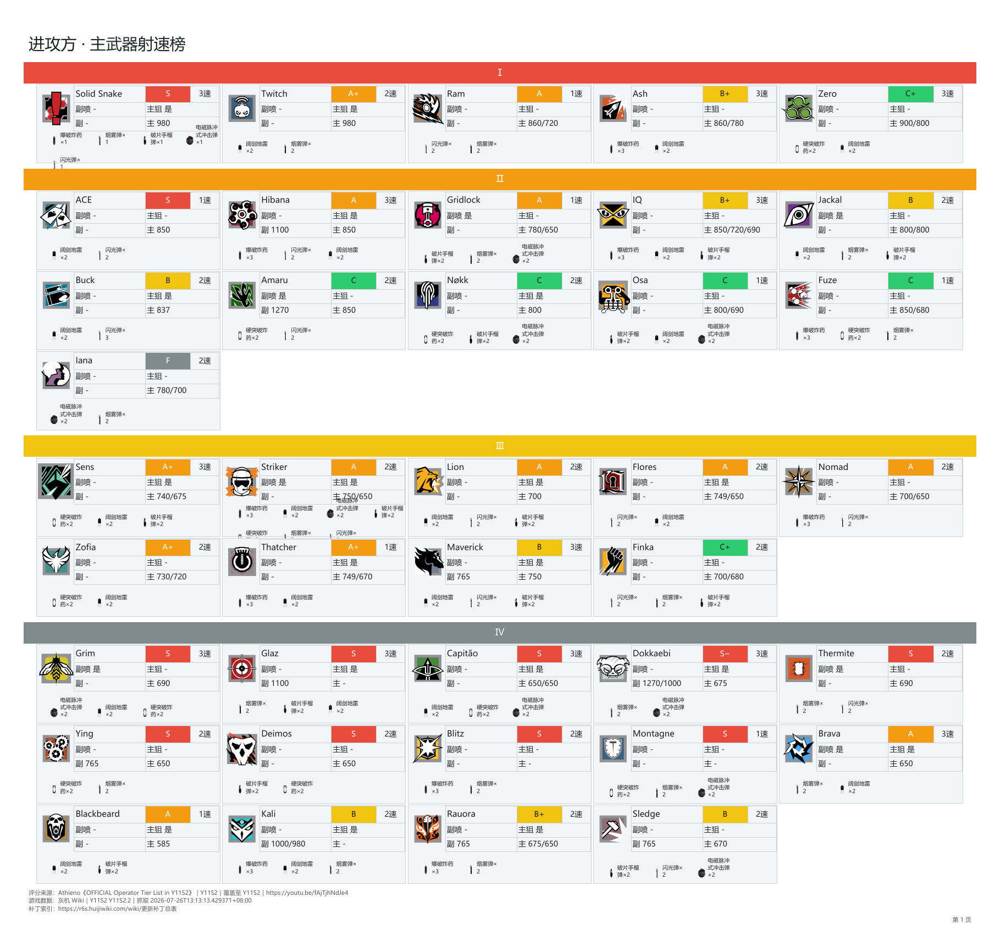
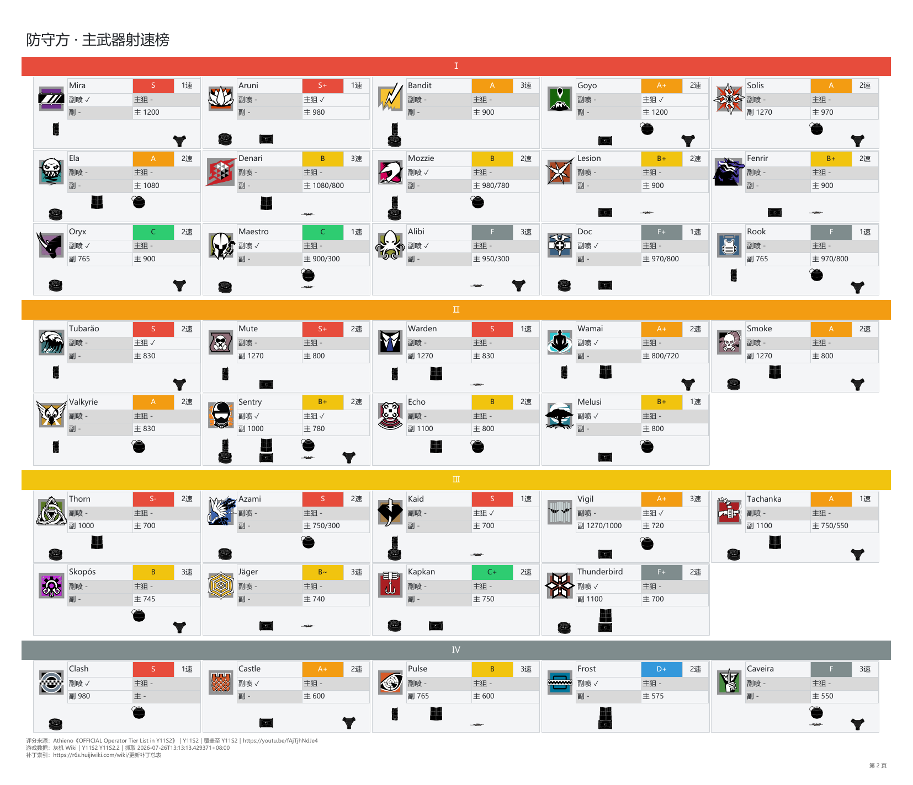
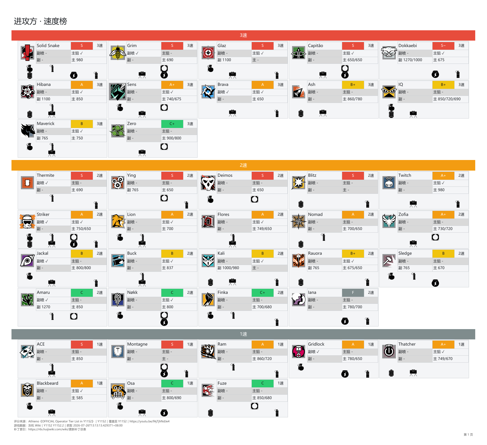
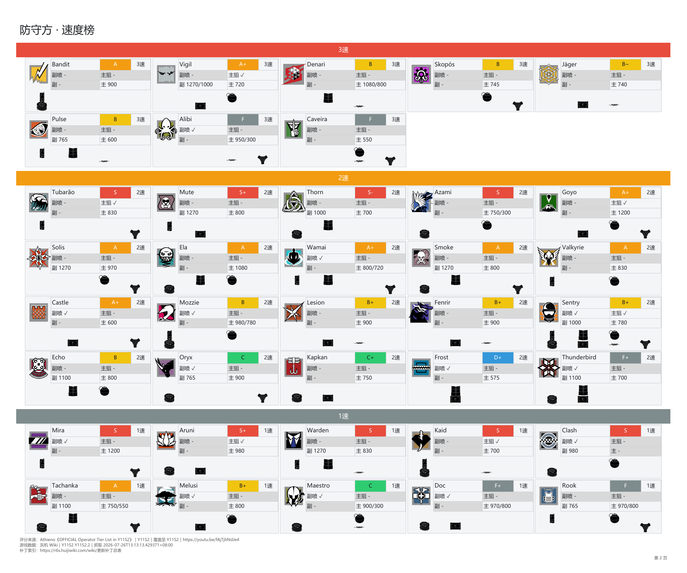
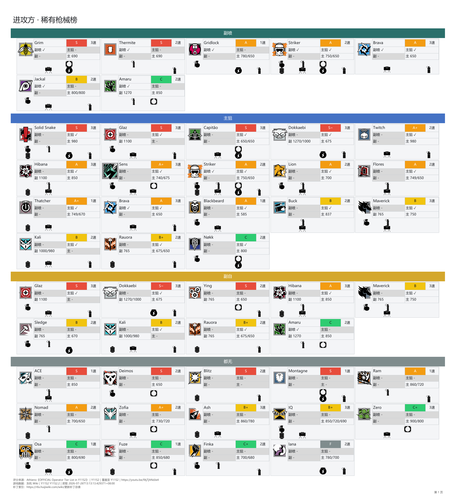
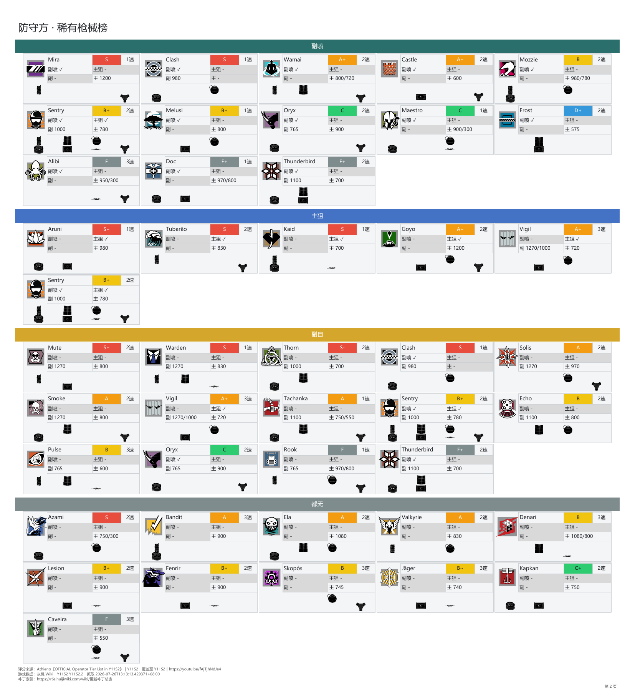
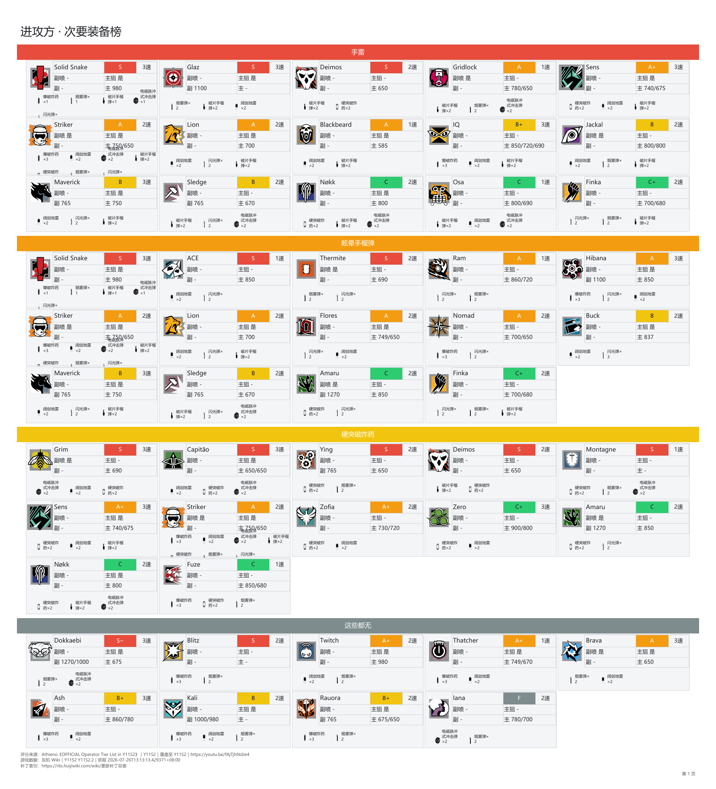
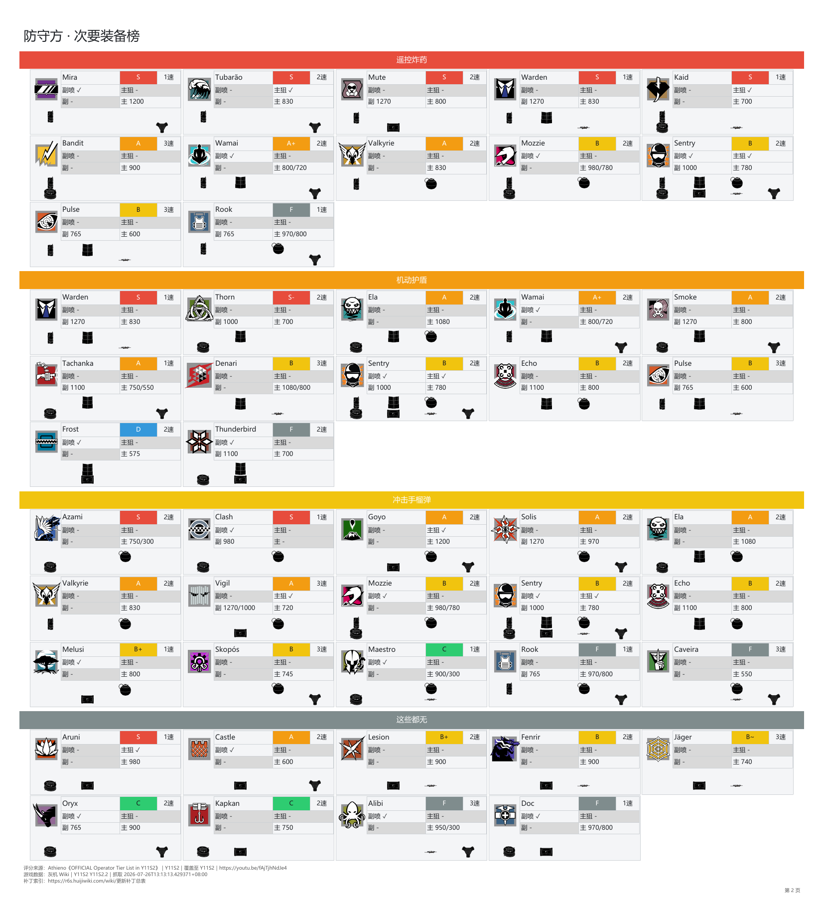

# R6 干员中文榜单

## 功能

- 将 Athieno 人工核对的干员 Tier 与灰机 Wiki 当前数据合并。
- 原子采集 Wiki 表格、干员图标、次要装备图标及视频评分日期之后的补丁；采集失败时保留上一份有效快照。
- 生成视频评分、主武器射速、速度、稀有枪械、次要装备五种中文榜单。
- 每种榜单同时输出 XLSX、PDF 和逐页 PNG 图片版：
  - XLSX 包含进攻方、防守方和补丁说明工作表。
  - PDF 固定为进攻方、防守方、补丁说明三页；每页保持 420 mm 宽并按实际内容自动调整高度，章节不会自动换页。
  - PNG 图片版按 PDF 原页直接以 144 DPI 栅格化，不裁剪、不重排、不拼接，保存在 `output/图片版/<榜单名>/`。
- 等级使用整行色带，卡片展示干员图标、视频 Tier、速度、主副手射速、稀有枪械状态和次要装备。
- 报告附带评分来源、Wiki 快照信息和补丁覆盖区间。
- PDF 由 ReportLab 直接生成，不依赖 Microsoft Excel 或 LibreOffice。

### 报告预览

#### 视频评分榜

[打开 PDF 报告](docs/视频评分榜.pdf)

| 进攻方 | 防守方 |
|:---:|:---:|
|  |  |

#### 主武器射速榜

[打开 PDF 报告](docs/主武器射速榜.pdf)

| 进攻方 | 防守方 |
|:---:|:---:|
|  |  |

#### 速度榜

[打开 PDF 报告](docs/速度榜.pdf)

| 进攻方 | 防守方 |
|:---:|:---:|
|  |  |

#### 稀有枪械榜

[打开 PDF 报告](docs/稀有枪械榜.pdf)

| 进攻方 | 防守方 |
|:---:|:---:|
|  |  |

#### 次要装备榜

[打开 PDF 报告](docs/次要装备榜.pdf)

| 进攻方 | 防守方 |
|:---:|:---:|
|  |  |

## 本地部署

环境要求：

- Windows
- Python 3.9+
- `curl.exe`
- 无需安装 Microsoft Excel 或 LibreOffice

### 1. 安装依赖

在 PowerShell 中进入项目目录，创建虚拟环境并安装依赖：

```powershell
cd r6_num
python -m venv .venv
.\.venv\Scripts\Activate.ps1
python -m pip install --upgrade pip
python -m pip install -r requirements.txt
```

### 2. 获取最新 Athieno Tier

在 Codex 中打开本项目并输入：

```text
$build-r6-operator-report 获取最新 Athieno 干员 Tier
```

### 3. 生成报表

运行完整采集与报表生成流程：

```powershell
.\run_r6_report.bat
```

如需使用现有 `data/` 快照重新生成榜单，不重新联网采集：

```powershell
$env:PYTHONPATH='src'
$env:PYTHONUTF8='1'
python -m r6_report.leaderboards `
  --data-dir data `
  --input data/r6_operator_stats.xlsx `
  --output-dir output
```

### 4. 验证

验证本地部署：

```powershell
$env:PYTHONPATH='src'
$env:PYTHONUTF8='1'
python -m unittest discover -s tests -v
```

### 生成文件

```text
output/
  视频评分榜.xlsx
  视频评分榜.pdf
  主武器射速榜.xlsx
  主武器射速榜.pdf
  速度榜.xlsx
  速度榜.pdf
  稀有枪械榜.xlsx
  稀有枪械榜.pdf
  次要装备榜.xlsx
  次要装备榜.pdf
  图片版/
    视频评分榜/
      第1页.png
      第2页.png
      第3页.png
    主武器射速榜/
    速度榜/
    稀有枪械榜/
    次要装备榜/
```
